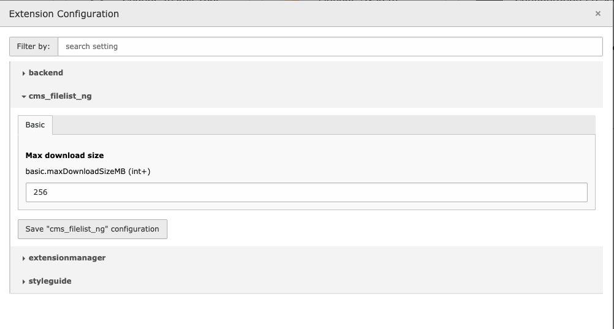

.. include:: ../Includes.txt

.. _configuration:

=============
Configuration
=============

General File List Configuration
```````````````````````````````
Go to the Settings - Extension Configuration and open the configuration of `mediamanager`. Here several settings are configurable:

+----------------------------+------------------------------------------------------------------------------------------------------------------------------+--------------------------+
|**Setting**                 |**Impact**                                                                                                                    |**Default**               |
+----------------------------+------------------------------------------------------------------------------------------------------------------------------+--------------------------+
|Max download size           |If the calculated size of the files selected for download exceeds the defined size, an error message will be returned instead |256                       |
+----------------------------+------------------------------------------------------------------------------------------------------------------------------+--------------------------+



