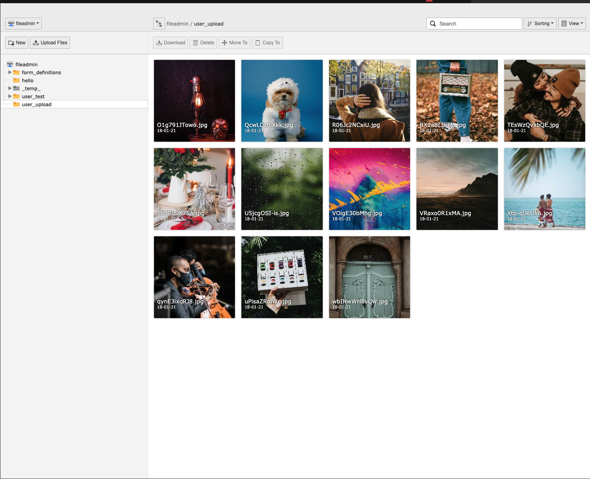

.. include:: ../Includes.txt

.. _introduction:

============
Introduction
============

What does it do?
================

The goal of this extension is to provide a handy & high-performance User Interface for file-list operations using cutting
edge technologies.

Screenshots
===========

This chapter should help people understand how the extension works.
Remove it if it is not relevant.

   Filelist module after installation (caption of the image).

How the Frontend of the Introduction Package looks like after installation (legend of the image).
